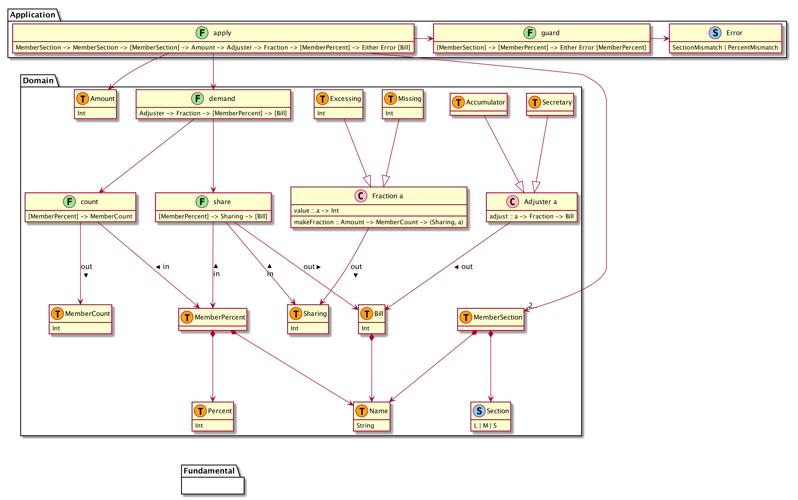
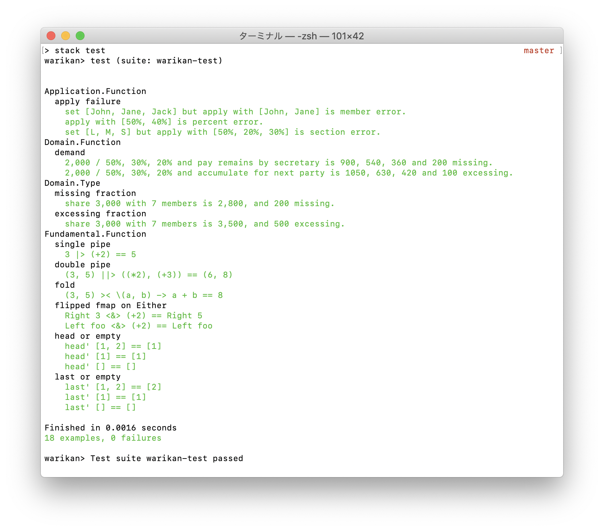

# やってみて
## デモ大事だねって話
ぶっちゃけお題が理解できないw

ここ

> 幹事が、システム上の、開催した**飲み会**の**支払区分**(多め,普通,少なめ)ごとに**支払割合**を設定する

最初読んだときは多め等の設定を見てシステムが割合を自動導出するのかと思ったのでそう作った

今回は多め等の設定を見て幹事がパーセントを入力するんだと思った

けど今は多め等の設定を見て幹事が 120% とか 80% とかを入力するのかなと思っている

walking skeleton って大事だよねってはなしw

## 要件は絞った
２回目だし、人の増減とかはコアドメインじゃあないなと思って削った

application layer も割と適当



## 設計とかドキュメントとか
### haddock を書いてみたよ
javadoc 的なやつ

readme からもリンクしてあるけど、生成物を github pages に置いてみた

たとえば先述の`Error`とかも、説明付きで出る → [haddock](https://suzuki-hoge.github.io/warikan/2020-02-haskell/haddock/Application-Type.html)


## 作り
### repl is great
```haskell
ghci> makeFraction Missing (Amount 3000) (MemberCount 7)
(Sharing 2800,MissingAmount 200)
```

こんな感じで適当に作って組み合わせていく

とにかく軽い

### private private method
名前は適当w

private method の公開範囲が広くて常々嫌なんだけど、今回は極隠蔽した

```haskell
-- | Fix bills.
demand :: (Adjuster adjuster, Fraction fraction) => adjuster -> fraction -> Amount -> [MemberPercent] -> [Bill]
demand adjuster fraction amount mps =
  count mps
  |> makeFraction fraction amount
  ||> (share mps, adjust adjuster)
  >< (\(bs, b) -> bs ++ [b])
      where
        count :: [MemberPercent] -> MemberCount
        count = MemberCount . length

        share :: [MemberPercent] -> Sharing -> [Bill]
        share mps (Sharing s) = map (\(MemberPercent name (Percent p)) -> Bill name (s * p `div` 100)) mps
```

関数の中のローカル変数で関数を作るだけ

scala とか python とかでも全然できるし、java もまぁ`Function<...>`で頑張ったらある程度はできる

処理ブロックに`// 以下計算` `// ここまで`とかコメントするくらいなら名前つければ良いじゃん、変数スコープもはっきりするし、という感じ

これも repl で作ってできたと思ったら組み入れる、そうやって大きい関数を作る

### non empty list
idris みたいに証明まではしてないけど、引数を 1 + n にして参加者は空リストにならないようにした

### package
今回は依存方向とかの整理は目的から外したので 1 package のみ

ただなんとなく haskell 風味にしてみようと思って、`Domain.Function`と`Domain.Type`を export する`Domain`というのを置いてみた

`Http.Client.Type`と`Http.Client`がこんな構成だった気がする、ディレクトリと同名のファイルを作るという発想が斬新に感じた

### error is type
application layer で発生するエラーが型になっている

```haskell
data Error = MemberError     -- ^ Mismatch in MemberSection names and MemberPercent names.
           | PercentError    -- ^ Sum of percent does not 100%.
           | SectionError    -- ^ Specified percent is not in section range.
           deriving (Show, Eq)
```

### behavior driven development test
hspec は bdd テストツールとのこと

テスト結果がビジネスを説明する様に書いてみたいと思う

結果はこんな感じ



### type safe!
idris ほどではないにせよ、コンパイルが通ったら「あ、じゃあできたな」という気持ちになる

ただ残念ながら標準の`head :: [a] -> a`だけは実行例外が出るので、`head' :: [a] -> [a]`を作った

ここに関しては prelude を読み込まないでサードパティのを使う人も結構いるっぽい

### ore ore operator
演算子作るの楽しい

`|>`とか超適当に作った

`infixl 2`とかで優先度を決められる

`$`より低いと`print $ 2 |> (+2)`とかがコンパイルできなかったりするので、色々調整した

