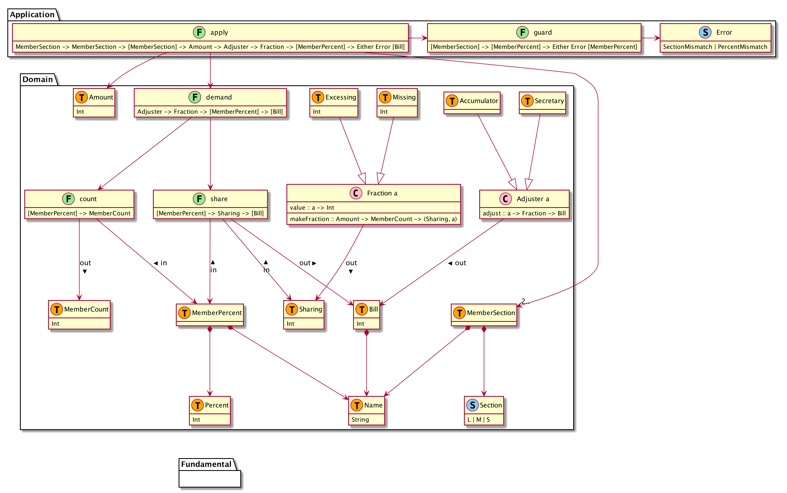

# warikan
## model


## document
show [haddock](https://suzuki-hoge.github.io/warikan/2020-02-haskell/haddock/index.html).

## test result


## stack commands
### test
```
$ stack test
```

### repl
```
$ stack ghci

ghci> :l Main

ghci> main
```

### haddock
```
$ stack haddock --haddock-arguments --odir=haddock
```
